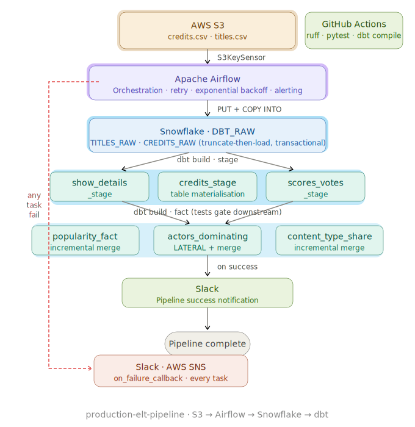

# production-elt-pipeline

An end-to-end ELT pipeline built with Apache Airflow, AWS S3, Snowflake, and dbt.



---

## Stack

| Layer | Tool |
|---|---|
| Orchestration | Apache Airflow |
| Storage | AWS S3 |
| Data warehouse | Snowflake |
| Transformation | dbt (dbt-snowflake) |
| Alerting | Slack, AWS SNS |
| Secrets | AWS SSM Parameter Store |
| CI/CD | GitHub Actions |

---

## How it works

The pipeline runs daily. It picks up two CSV files from S3, loads them into Snowflake, and transforms them into reporting tables using dbt.

A few design decisions worth calling out:

**File arrival is handled by a sensor, not a schedule assumption.** Two `S3KeySensor` tasks wait up to 6 hours for `credits.csv` and `titles.csv` to appear. They run in parallel and use `mode='reschedule'` so they release their worker slots between checks. If a file doesn't arrive, the task fails and an alert fires.

**The load is transactional.** Both raw tables are truncated and reloaded inside a single Snowflake transaction. If either fails, both roll back. You never end up with one table updated and the other stale. Running the pipeline twice gives the same result as running it once — this property is called idempotency.

**dbt tests gate downstream models.** The pipeline uses `dbt build`, not `dbt run`. This means each model is tested immediately after it's built. If a staging model fails its tests, the fact models that depend on it won't run. Bad data can't propagate downstream.

**Fact models are incremental.** Stage models are rebuilt from scratch on every run (they're small). Fact tables use an incremental merge strategy — only new or updated rows are processed. This avoids full rebuilds on large tables.

**Failure alerts are wired at the DAG level.** `on_failure_callback` is set in `default_args`, so every task in the DAG fires Slack and SNS alerts on failure automatically. Nothing fails silently.

**Secrets never touch the codebase.** Snowflake credentials are fetched from AWS SSM Parameter Store at runtime. The `.env` file holds non-sensitive config only.

---

## Project structure

```
production-elt-pipeline/
├── airflow/
│   └── dags/
│       ├── netflix_analytics.py       # Main DAG
│       ├── source_load/
│       │   └── data_load.py           # S3 → Snowflake load
│       └── alerting/
│           └── slack_alert.py         # Success + failure alerts
├── dbt/
│   ├── dbt_project.yml
│   ├── packages.yml
│   ├── profiles.yml.template
│   └── models/
│       └── netflix/
│           ├── stage/                 # Cleaned raw data (table)
│           │   ├── show_details_stage.sql
│           │   ├── credits_stage.sql
│           │   ├── scores_votes_stage.sql
│           │   ├── src_netflix.yml    # Source definitions + freshness
│           │   └── stage_netflix.yml  # Schema tests
│           └── fact/                  # Reporting tables (incremental)
│               ├── popularity_fact.sql
│               ├── actors_dominating_fact.sql
│               ├── content_type_share_fact.sql
│               └── fact_netflix.yml
├── .env.example
├── .gitignore
└── .github/
    └── workflows/
        └── ci.yml
```

---

## dbt models

### Stage layer (`DBT_STAGE`)

Materialised as `table`. Rebuilt from scratch on every run.

| Model | What it does |
|---|---|
| `show_details_stage` | Cleans titles: casts types, standardises nulls, parses genres |
| `credits_stage` | Filters to actors only, normalises name casing |
| `scores_votes_stage` | Casts IMDB score and vote count to correct numeric types |

### Fact layer (`DBT_TRANSFORM`)

Materialised as `incremental` with `strategy: merge`. Only processes rows newer than the last run.

| Model | What it does |
|---|---|
| `popularity_fact` | IMDB score, vote count, and age rating per title |
| `actors_dominating_fact` | Actor appearance count per genre (uses `LATERAL SPLIT_TO_TABLE` to explode comma-separated genres) |
| `content_type_share_fact` | Movie vs TV show split by genre |

---

## Setup

### 1. Clone the repo

```bash
git clone https://github.com/GhazT1/production-elt-pipeline.git
cd production-elt-pipeline
```

### 2. Configure environment variables

```bash
cp .env.example .env
```

Edit `.env` with your AWS region, S3 bucket name, and SNS topic ARN. Snowflake credentials are not stored here — they live in SSM (see step 4).

### 3. Set up dbt profiles

```bash
cp dbt/profiles.yml.template ~/.dbt/profiles.yml
```

The profile reads credentials from environment variables at runtime. No hardcoded values.

### 4. Store Snowflake credentials in AWS SSM

```bash
aws ssm put-parameter --name /netflix-pipeline/snowflake/username --value "YOUR_USER" --type SecureString
aws ssm put-parameter --name /netflix-pipeline/snowflake/password --value "YOUR_PASSWORD" --type SecureString
aws ssm put-parameter --name /netflix-pipeline/snowflake/account  --value "YOUR_ACCOUNT" --type SecureString
```

### 5. Configure Slack

Add a Slack webhook connection in the Airflow UI with connection ID `slack_default`. Set the webhook URL as the connection password.

### 6. Run dbt

```bash
cd dbt
dbt deps
dbt build --target dev
```

Use `--store-failures` in production to write failing test rows to Snowflake audit tables:

```bash
dbt build --store-failures
```

---

## CI/CD

Every pull request to `main` runs two checks:

**Python checks** — `ruff` lints the Airflow DAGs and `pytest` runs unit tests.

**dbt compile** — compiles all models against placeholder credentials to catch SQL syntax errors without needing a live Snowflake connection.

Neither check requires real credentials. Merges to `main` are blocked until both pass.

---

## Lineage

```
TITLES_RAW  ──▶  show_details_stage  ──▶  popularity_fact
                                     ──▶  content_type_share_fact
CREDITS_RAW ──▶  credits_stage       ──▶  actors_dominating_fact
TITLES_RAW  ──▶  scores_votes_stage  ──▶  popularity_fact
```
